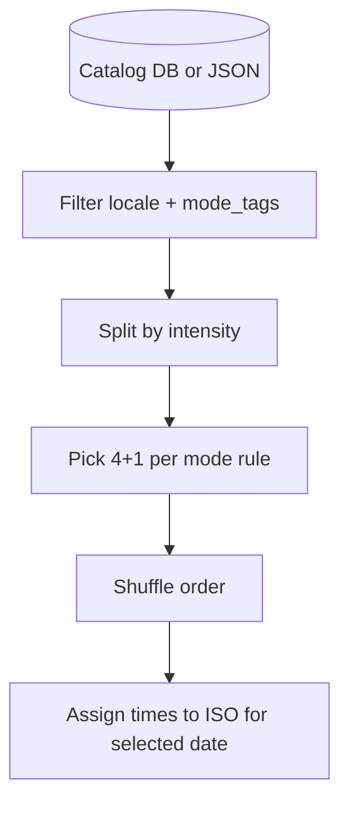

# 内容池升级：活动目录、强度二元分类与外部数据源

## 需求摘要（相对前一版「整段 JSON 日程模板」的调整）

- **不再**优先使用「一整天的固定 5 事件模板」；改为 **活动粒度** 的目录 + **运行时组合**。
- **高效（productive）模式**：一次生成 **5 个事件** = **4 个高强度 + 1 个低强度**（低强度作为恢复/缓冲块）。
- **清闲（chill）模式**：**4 个低强度 + 1 个高强度**（高强度作为「点睛」或轻挑战，避免全天过于涣散——若你希望纯 5 低也可改为可配置）。
- 每条活动需 **二元强度**：`intensity: 'high' | 'low'`（后续可扩展为三档，但先二元以简化抽取逻辑）。
- **活动文案从哪来**：希望支持 **外部数据库** 维护与扩容，而非写死在前端。

## 数据模型

### 活动目录项（catalog item）

与现有 `[ScheduleEvent](file:///Users/cindy_sun/Desktop/SOFTWARE/Feather-Schedule-main/src/types.ts)` 生成所需字段对齐，建议目录存「半结构化」数据，运行时再补 `id`、具体日期的 ISO 时间：

| 字段                         | 说明                                                                 |
| -------------------------- | ------------------------------------------------------------------ |
| `title`                    | 标题                                                                 |
| `description`              | 短描述                                                                |
| `type`                     | 与产品一致：建议统一为 `meeting`                                              |
| `intensity`                | `**high`                                                           |
| `mode_tags`                | 可选：`productive` / `chill` / `both`，用于过滤「只适合做高效日」的活动（避免把深度工作块抽进清闲日） |
| `locale`                   | `zh`                                                               |
| `default_duration_minutes` | 可选，用于排时间                                                           |
| `sort_weight`              | 可选，用于加权随机                                                          |

### 组合规则（composer）

输入：`mode: 'productive' | 'chill'`，`language`，可选 `seed`（同日稳定）。

1. 从目录筛选：`locale` 匹配，且 `mode_tags` 含当前 mode 或 `both`。
2. 按强度分两组：`high[]`、`low[]`。
3. **productive**：`shuffle` 后取 `high` 中 4 条、`low` 中 1 条；若某一组不足则 **有放回抽样** 或合并降级策略（计划实现时二选一写清）。
4. **chill**：取 `low` 中 4 条、`high` 中 1 条；同样处理不足。
5. **排序与时间**：5 条得到后 **随机打乱顺序** 或按固定模板顺序（晨→午→晚）；再用 **时间轴算法** 填入当日 `startTime`/`endTime`（例如从 09:00 起按 `default_duration_minutes` 累加，留出午餐空档）。算法可放在 `[src/lib/contentPools.ts](file:///Users/cindy_sun/Desktop/SOFTWARE/Feather-Schedule-main/src/lib/contentPools.ts)`（新建）或 `scheduleComposer.ts`。

## 「外部数据库」可选方案（推荐顺序）

### 方案 A：Supabase 表（与现有栈一致）

- 新表例如 `public.schedule_activity_catalog`（名称可再定）。
- 列：上述 catalog 字段 + `id`（uuid）+ `created_at`。
- **RLS**：`select` 对 `anon` + `authenticated` 开放（只读公共模板）；`insert/update/delete` 仅 `service_role` 或维护者账号，避免被刷写。
- **种子数据**：  
  - 一次性：`supabase/migrations` 里 `INSERT` 一批中英文活动；或  
  - 离线脚本：读 `GEMINI_API_KEY` 批量生成 JSON → `upsert` 到表（与现有一致）。
- **前端**：`supabase.from('schedule_activity_catalog').select().eq('locale', ...)` 拉全量或分页缓存到内存；**composer 在客户端** 完成 4+1 抽取（避免为每次随机打 RPC）。若目录很大可只拉 `mode_tags` 过滤后的子集（需索引 `(locale, mode)` 或 jsonb 标签策略）。
- **优点**：不发版即可增删改活动；可多端共用；易做运营后台。  
- **缺点**：首屏多一次请求；需处理离线（见方案 C）。

### 方案 B：构建时导出 JSON（DB 为「真源」，前端只读文件）

- 真源仍是 Supabase 或运营用表格（CSV）；CI 或本地跑 `scripts/export-catalog-to-json.mjs` → 写入 `[src/data/contentPools/activities.*.json](file:///Users/cindy_sun/Desktop/SOFTWARE/Feather-Schedule-main/src/data/contentPools/)`。
- **优点**：零额外请求、离线可用、与 Vite 打包一致。  
- **缺点**：更新活动需跑导出 + 发版（或改 CDN 静态 JSON）。

### 方案 C：混合（推荐工程默认）

- **首选**：构建产物内嵌 **基线 JSON**（保证离线与小包体验）。
- **可选**：在线时 `fetch` Supabase（或静态 `public/catalog.json`）做 **delta 或全量替换**，带 `version` 与本地 `localStorage` 缓存 TTL。
- composer 逻辑 **同一套**，数据源实现 `getCatalogItems(): Promise<CatalogItem[]>` 接口。

### 方案 D：第三方开放数据

- 通用「活动名称」类开放数据少且偏西方、偏百科，**难以**直接满足「叙事化日程 + 中英 + chill/productive」调性；可作为 **灵感词表**，仍需人工或 LLM 批处理成目录项。**不建议**作为主数据源。

## 离线脚本（与旧计划的关系）

- 旧计划中的「整段日程 JSON 批量生成」可 **降级为**：脚本只生成 **活动目录行**（含 `intensity`、`mode_tags`），写入 DB 或 JSON。
- 仍用 `@google/genai` + 环境变量密钥；校验 JSON schema、去重 `title+locale+intensity`。

## 实现任务拆分（在原内容池计划上增量）

1. **类型**：在 `src/types.ts` 或 `contentPoolsTypes.ts` 增加 `CatalogActivity`、`Intensity`；解决 `personal` vs `EventType` 的映射（composer 输出合法 `ScheduleEvent`）。
2. **Composer**：`composeRandomDaySchedule(mode, locale, dateKey)` → `ScheduleEvent[]`（5 条）。
3. **数据源**：实现 `getCatalog` 的 JSON 版 +（可选）Supabase 版。
4. **App**：`[handleGenerateSchedule](file:///Users/cindy_sun/Desktop/SOFTWARE/Feather-Schedule-main/src/App.tsx)` 改为调 composer，去掉对整段模板 JSON 的依赖；保留网络失败时的极简 fallback。
5. **测试**：Vitest 对 composer 做表驱动测试（mock catalog 各强度数量充足 / 不足边界）。

## 待你确认（可选）

- **chill 的「1 个高强度」** 是否保留：若希望 **5 个全低**，可将规则改为配置表 `chill: { high: 0, low: 5 }`，productive 仍为 `4+1`。

## 验收

- productive / chill 各点多次随机，强度计数稳定符合 4+1；语言与 mode 过滤正确。
- 目录可从 Supabase 或本地 JSON 加载；离线至少本地 JSON 可用。

