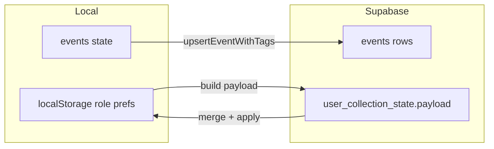

# 角色能量与事件标签管理（含跨设备同步）

## 范围与入口

- **入口 UI**：在 `[src/components/RoleEnergyCard.tsx](src/components/RoleEnergyCard.tsx)` 与 `[src/components/EventVolumeCard.tsx](src/components/EventVolumeCard.tsx)` 的标题行使用 `flex justify-between`，右侧放「管理」文字按钮（英文 **Manage**，Title Case），与现有 `h3` 风格一致。
- **人生之书嵌入块**：`[src/components/ChapterPeriodStatusSection.tsx](src/components/ChapterPeriodStatusSection.tsx)` 内「角色能量」「事件标签分析」小标题若需同一能力，应**复用同一套弹窗组件**（通过 props 打开），避免两套逻辑分叉；若首版只改收藏页，需在实现时二选一并写清产品范围。

## 数据模型与既有代码对齐

- **角色**：`[src/types.ts](src/types.ts)` 中 `role?: string` 为 **canonical id**（预设如 `nurturer`，自定义 `custom:…`），见 `[src/lib/constants/roles.ts](src/lib/constants/roles.ts)`。
- **事件标签统计口径**（管理弹窗顶部一句话）：与 `[src/lib/chapterPeriodStats.ts](src/lib/chapterPeriodStats.ts)` / `computeEventTagSlicesFromExpanded` 一致——**仅统计日程上的 `label.text` 与 `tags[]` 展开实例**，不含日历日标签。
- **批量写日程**：对齐 `[App.tsx](src/App.tsx)` 中 `handleRenameLongTermGoal` / `handleDeleteLongTermGoal`：逐条（或分批）`upsertEventWithTags(supabase, user.id, updated)`，再 `setEvents`；未登录则仅本地 `setEvents`（与现有长期目标行为一致，需在文案或逻辑上保持一致）。

## 角色能量 — 管理弹窗功能

| 能力       | 实现要点                                                                                                                                                                                                                                                                                |
| -------- | ----------------------------------------------------------------------------------------------------------------------------------------------------------------------------------------------------------------------------------------------------------------------------------- |
| 统计口径     | 顶部一句：例如「按展开后的日程实例，按角色聚合占比」类表述，与卡片算法一致（`[RoleEnergyCard](src/components/RoleEnergyCard.tsx)` 使用 `expandRecurringEvents` + `aggregateByRole`）。                                                                                                                                        |
| 重命名（含预设） | 将 **所有** `event.role === oldId` 更新为 **newId**（trim、校验非空）。预设 id（如 `nurturer`）可改为新的 canonical 字符串（推荐新自定义：`custom:显示名` 的规范化形式，与 `[AddEventModal](src/components/AddEventModal.tsx)` 一致），并在 **role 目录**中写入继承色（见下），保证 `getRoleColor` 不降级为哈希色。                                            |
| 合并确认     | 若 `newId` 已存在且与当前编辑的 **非同一** 角色冲突：弹窗「已有此角色，是否合并？」是/否（文案风格对齐长期目标删除）。**是**：等价于把所有 `oldId` 改为 `newId` 并去重（单条事件不应出现重复 `role`）。                                                                                                                                                          |
| 删除       | 与 `[LongTermGoalsCard](src/components/LongTermGoalsCard.tsx)` 删除确认一致：`createPortal` + 遮罩 + `motion` 卡片 + 是/否；说明文案改为：**日程保留，仅清除该角色字段**（对齐 `handleDeleteLongTermGoal` 的「事件保留、清标签」叙事）。确认后：所有 `event.role === id` 置 `undefined`；对**预设角色**额外把该预设 id 记入 **跨设备同步的「已删除预设」集合**，新建日程时不再展示该预设。 |
| 历史计数     | 建议：**全库**范围内统计 **主事件条数**（`events` 数组中 `role === id` 的 `ScheduleEvent` 个数，重复系列算 1），与图表「展开实例数」区分，在 UI 用小字说明「按日程条数，非展开实例数」。                                                                                                                                                            |

## 事件标签分析 — 管理弹窗功能（补充）

| 能力            | 实现要点                                                                                                                                                                               |
| ------------- | ---------------------------------------------------------------------------------------------------------------------------------------------------------------------------------- |
| 统计口径          | 同上一节，强调 **不含日历日标签**。                                                                                                                                                               |
| 自定义标签池        | 延续 `[src/lib/customEventTagsStorage.ts](src/lib/customEventTagsStorage.ts)` 的池与 `lastUsed`；重命名/合并时同步改写 `loadSavedCustomEventTags` 与 `customEventTagLastUsed` 的 key（与现 merge 策略兼容）。 |
| 预设标签          | 只读说明：内置快捷名称来自 `PRESET_EVENT_LABELS_`*；用户可通过对 **日程上已写死的字符串** 做批量替换达到「改名」效果，逻辑上与自定义标签同一套迁移函数。                                                                                        |
| 重命名 / 删除 / 合并 | 对每条事件：若 `label.text === old` 则改为 `new` 或清空；`tags` 数组中将 `old` 替换为 `new` 并 **去重**；删除标签则移除 `label` 中匹配或从 `tags` 移除。合并确认与角色侧相同。                                                        |
| 历史计数          | 全库 **主事件条数**：`label.text === tag` 或 `tags` 含该字符串（trim 一致）。                                                                                                                         |
| 导出            | 三种：**CSV**（表头 + 行）、**Markdown**（表格或列表）、**复制到剪贴板**（与 Markdown 或 CSV 一致即可）；可先做「当前筛选标签」或「全量标签汇总表」，在弹窗内用单选固定一版避免范围歧义。                                                                  |

## 跨设备同步（强制）

1. `**events` 表**：角色/标签的增删改必须通过现有 repository 写入（与长期目标相同），这样多设备拉取日程后数据一致。
2. `**user_collection_state`**：扩展载荷，**必须** bump `[COLLECTION_STATE_VERSION](src/lib/collectionStatePayload.ts)`（例如 `1` → `2`），新增字段至少包括：
  - `**hiddenPresetRoleIds: string[]`**：用户「删除」过的预设角色 id；`[mergeCollectionStatePayloads](src/lib/collectionStatePayload.ts)` 对数组做 **并集**；`[applyCollectionStatePayloadToLocal](src/lib/collectionStateApply.ts)` 写入 localStorage；`[buildCollectionStatePayloadFromLocal](src/lib/collectionStatePayload.ts)` 读回。
  - `**roleCatalog: Record<string, { color: string; updatedAt: number }>`**（或等价结构）：为迁移后的 `custom:…` id 保存继承色，合并时 **按 `updatedAt` 取较新**。`getRoleColor` / `getRoleDisplayName`（`[roles.ts](src/lib/constants/roles.ts)`）优先读目录再回退预设/哈希。
3. **自定义标签**：继续走现有 `customEventTags` + `customEventTagLastUsed`；重命名键时触发 `notifyCollectionStateChanged` + `schedulePushCollectionClientState`，与现有一致。
4. **文档**：更新 `[.cursor/rules/cloud-sync-data-boundary.mdc](.cursor/rules/cloud-sync-data-boundary.mdc)` 中 `CollectionStatePayload` 表格与 `COLLECTION_STATE_VERSION` 说明（工作区规则要求）。

## App 层职责

- 在 `[App.tsx](src/App.tsx)` 新增（或抽到 `src/lib/` 的纯函数 + 回调）：
  - `migrateEventRole(oldId, newId, options?: { merge?: boolean })`
  - `clearEventRole(roleId)` + 更新 `hiddenPresetRoleIds`
  - `migrateEventTag(oldTag, newTag, ...)`（含 `label` + `tags[]` + customEventTags 存储）
- 通过 props 传入 `RoleEnergyCard` / `EventVolumeCard`（或 Context，以项目习惯为准），避免子组件直接依赖 `supabase`。

## 测试与验收

- 单元测试：标签/角色字符串替换与去重、merge 后 `tags` 无重复；可选：payload merge（hidden 并集、roleCatalog `updatedAt`）。
- 手动：登录双设备，一端改名/删预设/改标签池，执行既有「全量同步」或等待 debounce push 后另一端数据一致。

## 风险与说明

- **冲突**：两设备同时改同一事件以 `events` 行级更新为准，属预期；标签池 merge 已为 union，重命名 key 的冲突需依赖事件内容最终一致后再推送池。
- **性能**：全量事件很多时，批量 `upsert` 可考虑分批 + 进度条（若 UX 需要）。

